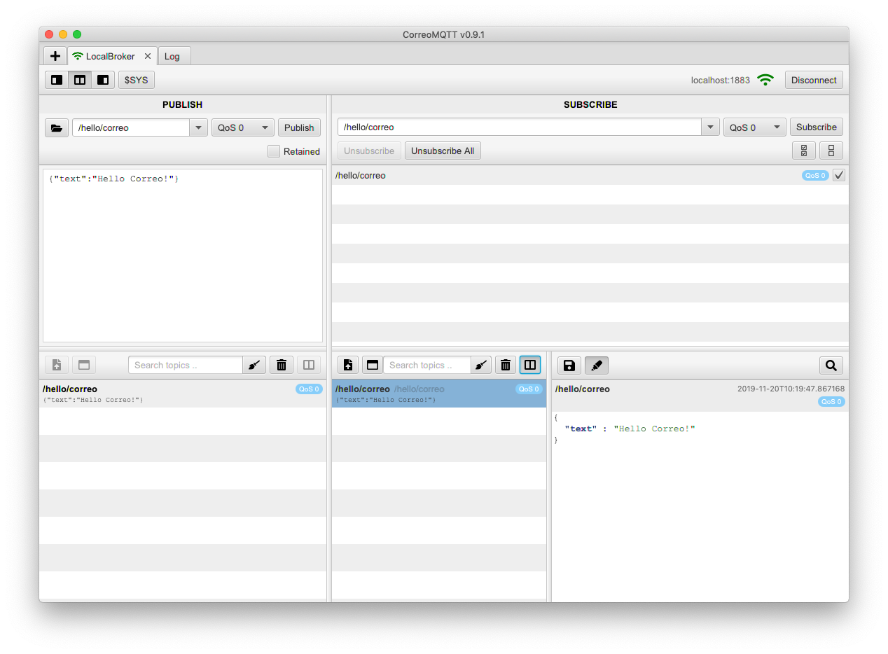

# CorreoMQTT
A modern graphical MQTT client using the HiveMQ client library.



## Prerequisites

* Install Java 13 e.g. from here https://www.azul.com/downloads/zulu-community/ (Note: No JavaFX is required, as it is handled via maven)
* Install Jpackage, if you want to build native installers: https://jdk.java.net/jpackage/

## Build app
`mvn clean package`

## Run jars

`java -jar target/shade/correomqtt.jar`

## Build Installers

Installers must be built on their respective platform.

* `./build_mac.sh`
* `./build_win.sh`
* `./build_linux.sh`


## Plugins
To install a plugin copy the `.jar` into the `plugins/jars` directory. 
This directory can be opened through a button in the plugins menu in the application.

## Manage execution order
Inside the `plugins` folder create a file called `protocol.xml`.

It has the following structure:
```xml
<?xml version="1.0" encoding="UTF-8"?>
<protocol>
    <lists>
        <PublishMessageHook>
            <plugin name="example-plugin-1"/>
            <plugin name="example-plugin-2"/>
        </PublishMessageHook>

        <MessageIncomingHook>
            <plugin name="example-plugin-2"/>
            <plugin name="example-plugin-1"/>
        </MessageIncomingHook>
    </lists>
</protocol>
``` 
For each extension point the order can be defined separately.

E. g. it's pretty common to use one order of plugin execution for sending messages and
reverse this order for incoming messages.

##### Attention
- If there is no plugin specified for an extension point,
all available extensions will be executed in a random order.  
- If two plugins implement extensions for the same extension point
and only one is declared, the other one won't be executed.

## Create Tasks
Some extension points will accept lists of extensions, called a task.
Tasks need to be defined inside the `protocol.xml` as well:
```xml
<?xml version="1.0" encoding="UTF-8"?>
<protocol>
    <lists>
    ...
    </lists>

    <tasks>
        <DetailViewManipulatorHook>
            <task name="Decode + unzip + save">
                <plugin name="base64-plugin" extensionId="decode" />
                <plugin name="zip-manipulator-plugin" extensionId="unzip" />
                <plugin name="save-manipulator-plugin" extensionId="save" />
            </task>
            ...
        </DetailViewManipulatorHook>

        <MessageValidatorHook>
<!--      specify tasks to validate messages in specific topics -->
            <task id="/com/+/example">
                <plugin name="xml-xsd-validator-plugin">
<!--                ### plugins may be configurable ###     -->
<!--                ###  check their documentation  ###     -->
                    <schema>Example.xsd</schema>
                </plugin>
            </task>
<!--        ### add more tasks as you wish ###              -->
        </MessageValidatorHook>
    </tasks>
</protocol>
``` 
The same extension may be used more than once in one task and multiple tasks can be defined.  

## Create a Plugin
The easiest way to get started is to checkout and modify the [example plugin](https://github.com/oemel09/CorreoMqttExamplePlugin).

Plugins are instantiated only once (singletons) and each extension will be instantiated every time it's called.
If an extension needs to keep reference to UI elements or needs to receive lifecycle-hooks it must implement a class extending `Plugin`.

### Access Plugin from Extension
To access the plugin object for an extension use this constructor
```
@Extension
public class ExampleExtension implements ExampleHook {

    public ExampleExtension(Plugin plugin) {
        this.plugin = (ExamplePlugin) plugin;
    }
    ...
}
```

### Permissions
If a plugin or extension needs more permissions it must provide a class extending `PermissionPlugin` which is a subclass of `Plugin`.
To add new permissions override the `Permissions getPermissions() {}` method.  

## Extensions
To provide a simple extension leave the `<plugin.class />` tag empty and create a new class
which implements your desired hook from the package `com.exxeta.correomqtt.plugin.spi`.

Annotate the class with the `@Extension` annotation from `PF4J` and that's it.

### Multiple Extensions for the same extension point in one Plugin
That's possible. Just add the `@ExtensionId("my-id")` annotation to each class.  
Users then need to declare the plugin inside the `plugins/protocol.xml` like this:
```xml
<plugin name="example-id" extensionId="my-id" />
```

### Configure Extensions
Users can configure each extension in the `plugins/protocol.xml`.  
```xml
<plugin name="example-id">
    <config>
        <example color="green" />
    </config>
</plugin>
```
Your extension receives this configuration each time it is instantiated.
Just implement this method:
```
void onConfigReceived(Element config) {}
```
Each extension can make up it's own configuration structure.


## PF4J
CorreoMQTT is using PF4J to provide it's plugin architecture.  
Learn more about PF4J on it's [official homepage](https://pf4j.org/).


## Licence 

Licensed under GPL v3.0.
